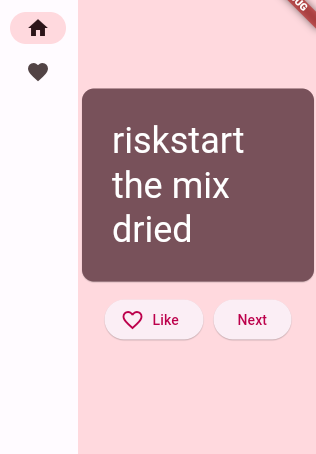

# Demon Lord Name Generator ⚡️

## A simple Flutter application to learn the framework.

<h2 align="center">
  
  <br>
</h2>

## Features

⚡️ Basic UI \
⚡️ One Page Layout\
⚡️ Side-nabigation 

---

## Getting Started 🚀

These instructions will guide you to set up and run a copy of the project on your local machine for development and testing purposes. Detailed notes on deployment can be found below.

### Prerequisites 📋

You need to have [Git](https://git-scm.com) and [Flutter](https://docs.flutter.dev/get-started/install) installed on your computer.

```
flutter@3.15.3 or higher
androidSDK@34.0.0 or higher
openJDK@1.8.0 or higher
gitp@2.42.0 or higher

```

## How To Use 🔧

1. Clone the repository and navigate to it in the terminal:

```bash
# Clone the repository
$ git clone https://github.com/tiboitel/flutter-getting-started

# Move into the repository
$ cd flutter-getting-started

# Remove the current origin repository
$ git remote remove origin

```

2. Check the project's dependencies:

Run the following command to check that your depencies are all up-to-date.

```bash
flutter doctor
```

Update the dependencies:

```bash
flutter pub get && flutter pub update
```

# Run the application on dev mode

To launch the application use the following command:

```bash
flutter run --debug
```

---

## Deployment 📦

It's totally depends on which platform you want to deploy. The best things is to follow the steps describe on the official documentation.

[How to deploy Flutter app](https://docs.flutter.dev/deployment) - Learn you everything you need to know.

## Technologies Used 🛠️

- [Flutter](https://flutter.dev/) - Build apps on any devices.


## License 📄

This project is licensed under the MIT License - see the [LICENSE](LICENSE) file for details.

## Author

- **tiboitel** - [GitHub Profile](https://github.com/tiboitel)